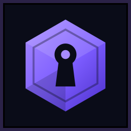
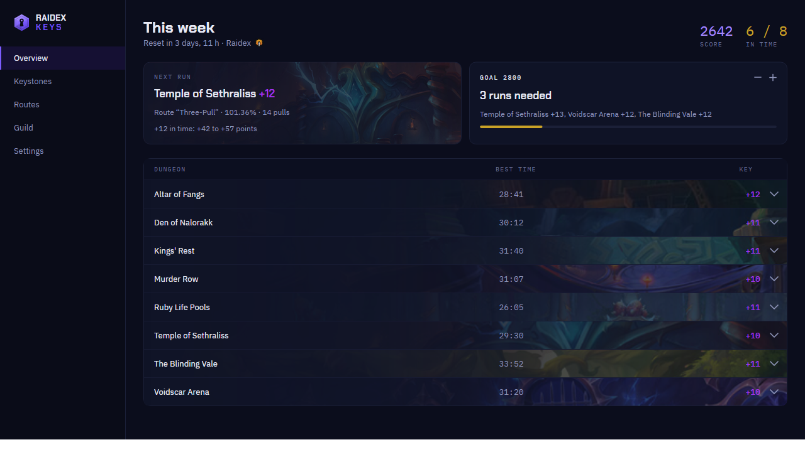

  

<h1 align="center">Raidex Keys</h1>

  <em>Deine Mythic+-Woche im Blick – auch wenn WoW zu ist.</em> 
  <em>Your Mythic+ week at a glance – even with WoW closed.</em>

  <a href="https://github.com/incudex/raidex-keys/releases"><b>Download</b></a> ·
  <a href="https://github.com/incudex/raidex-keys/issues/new/choose">Report a bug</a> ·
  <a href="https://raidex.app/keys/">raidex.app/keys</a>

  
  
  
  
  
  
  
  

Mythic+ keystones, ratings, the Great Vault, your Mythic Dungeon Tools routes
and your guild's keys: all of it on the desktop (Windows and Linux), outside
the game. A small WoW addon records what the game knows, and the app reads it.
Part of the [Raidex](https://raidex.app) family.

  

More pictures on [raidex.app/keys](https://raidex.app/keys/#einblicke).

This repository hosts the **releases**, the **issue tracker** and the
**addon** ([`addon/RaidexKeys`](addon/RaidexKeys)), in the form WoW loads it.
The desktop app is closed source, and its builds are free to use.

## Download

Get the [newest release](https://github.com/incudex/raidex-keys/releases).
It contains:

| File | What it is |
|---|---|
| `raidex-keys-<version>-win-x64-setup.exe` | the app for Windows 10 and 11 (64-bit), as installer. It installs for your user, no admin rights needed, and puts the WoW addon in too if you like. Uninstall it from Windows' app list. |
| `raidex-keys-<version>-win-x64.zip` | the same app without installing: unzip it anywhere and start `RaidexKeys.exe`. |
| `raidex-keys_<version>_amd64.deb` | the app for Debian 12+, Ubuntu 22.04+, Linux Mint 21+ and their relatives (64-bit). Install it with `sudo apt install ./raidex-keys_<version>_amd64.deb`, or open it with your package installer. `sudo apt remove raidex-keys` removes it again. |
| `raidex-keys-<version>-linux-x64.tar.gz` | the app for every other Linux (64-bit). Unpack it and run `./install.sh`, which installs to `~/.local`. `./install.sh --uninstall` removes it again. |
| `raidex-keys-addon-<version>.zip` | the WoW addon - the Windows installer brings it along. Unpack it into `World of Warcraft/_retail_/Interface/AddOns`. |
| `SHA256SUMS` | checksums of the files above |
| Source code (zip, tar.gz) | the addon as of this release, added by GitHub |

Windows may warn that it "protected your PC" when you start the installer or
the app for the first time: the files are not signed yet. Click "More info",
then "Run anyway".

Switching from `install.sh` to the `.deb`? Run `./install.sh --uninstall`
first - otherwise the copy in `~/.local` keeps starting instead of the
package. Your settings stay either way.

The app needs the addon. WoW saves the addon's data when you log out or type
`/reload`, and the app picks it up from there. When the app starts for the
first time, it asks for your AddOns folder - unless the Windows installer put
the addon in; then you confirmed the folder there.

## Report a bug or suggest something

[Open an issue](https://github.com/incudex/raidex-keys/issues/new/choose) and
pick the app or the addon. If you're not sure which one is at fault, pick the
app. You can write in German or English.

## Licence

Copyright © 2026 incūdex, Lars Gossard · <raidex@incudex.de>

- **The addon** is free software: you can redistribute it and/or modify it
  under the terms of the [GNU General Public License](LICENSE) as published
  by the Free Software Foundation, either version 3 of the License, or (at
  your option) any later version.
- **The desktop app** is freeware: free to use and to pass on unchanged, but
  not to modify or sell. The full terms are in `LICENSE.txt` in the
  download.

Both come without any warranty.

World of Warcraft is a trademark of Blizzard Entertainment, Inc. Raidex Keys is
not affiliated with Blizzard.
